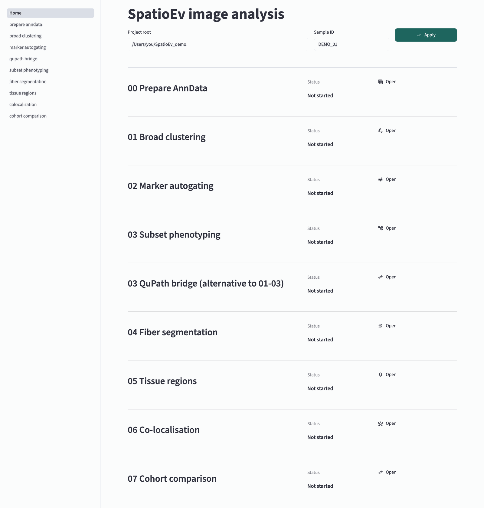

# 4. Open the app

The SpatioEv app runs on your own Mac and opens in your web browser. Nothing
is uploaded anywhere: "localhost" in the address means *this computer*.

## Start it

In Terminal:

```bash
conda activate spatioev_env
```

Then type `spatioev ui --project-root ` (with a space at the end), drag your
project-root folder from Finder onto the Terminal window, and press
++return++. It looks like this:

```bash
spatioev ui --project-root /Users/you/Data/TMA_072
```

Your browser opens the app at `http://localhost:8501` after a few seconds.

!!! warning "Leave Terminal open"
    Terminal is what runs the app. If you close that Terminal window, the app
    stops working (the browser page shows *Connection error*). To stop the app
    on purpose, click the Terminal window and press ++ctrl+c++.

!!! note "Analyses keep running in the background"
    When you press a *Run* button, the analysis runs as a separate background
    job. You can switch pages, or even close the browser tab, and it keeps
    going. Come back to the same page to see its progress and results.

## Getting a folder path

Many boxes in the app ask for a folder or file path. Never type them by hand:

- **Into Terminal:** drag the folder or file from Finder onto the Terminal
  window.
- **Into the app:** in Finder, right-click the folder while holding
  ++option++ and choose **Copy "…" as Pathname**. Click in the app's box,
  select what is there, and paste with ++cmd+v++.

Most boxes fill themselves in from the project root and sample ID, so you
rarely need this.

## The home page

{ width="900" }

1. **Project root**: the folder that holds your core folders. It is filled in
   from the Terminal command.
2. **Sample ID**: the core you are working on, for example `OXF047_6-C`.
   Every page uses it to fill in its file paths. Press **Apply** after
   changing either box.
3. **The stage list** shows each step and whether its result exists yet for
   this sample (*Ready* / *Not started*). **Open** goes to that step. The same
   pages are listed in the left sidebar.

!!! note "Stages 00–03 are an alternative to QuPath"
    *Prepare AnnData*, *Broad clustering*, *Marker autogating* and *Subset
    phenotyping* assign cell types inside SpatioEv by clustering and gating.
    This guide assigns cell types in QuPath instead
    ([step 5](qupath.md)), so you can skip those four pages.

## Pages share one pattern

Steps 6–8 all work the same way:

1. Type the **Sample ID** and press **Fill standard sample paths**. The input
   and output boxes fill themselves in.
2. Press **Inspect inputs**. The page reads your files and shows the choices
   that fit them (channels, cell types).
3. Choose settings and press the green **Run** button. A progress bar
   appears; results and pictures appear when it finishes.
4. When you are happy with that core, use **Run for every core** at the bottom
   of the page to repeat the same settings for all other cores.

Next: [Cell types in QuPath](qupath.md).
