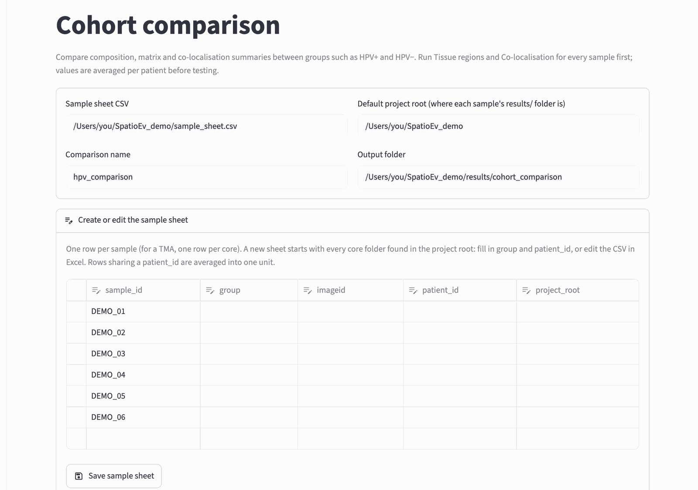
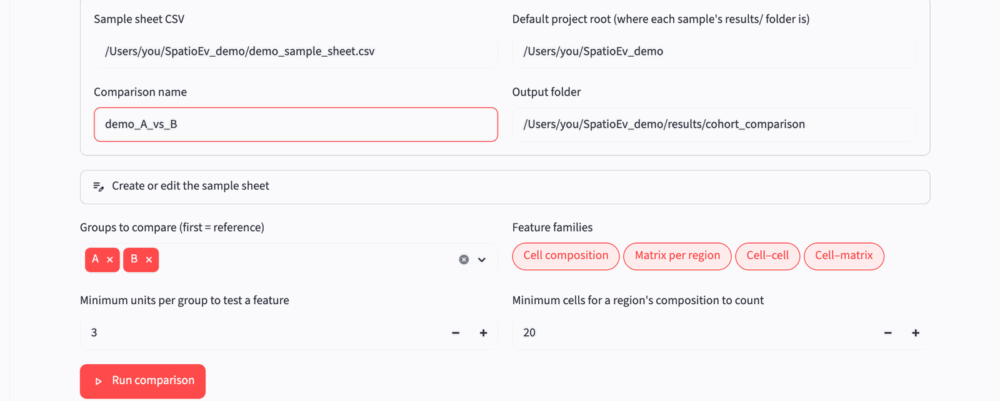
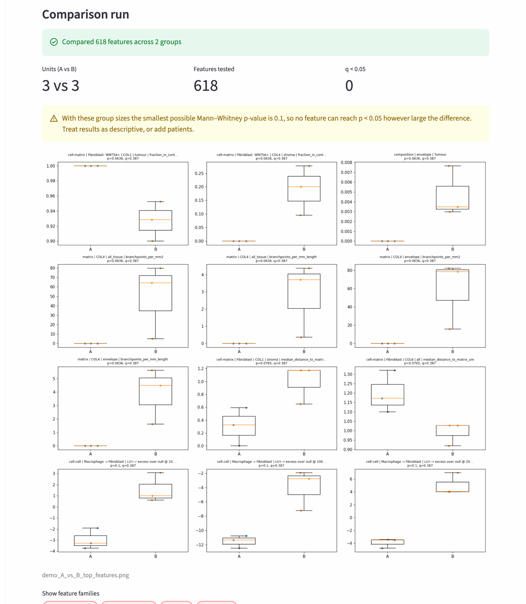

# 9. Compare groups

**What it does:** collects the results of [tissue regions](regions.md) and
[co-localisation](colocalisation.md) for every core, averages them per
patient, and tests every measurement between your groups (for example HPV+
vs HPV−).

**Before you start:** steps 7 and 8 are done for every core (*Run for every
core* on both pages reports no *failed* or *missing input* cores you care
about).

## Why "per patient"?

Two cores from the same patient are not independent: they share the
patient's biology. Counting them as two separate data points would make
differences look more certain than they are. So SpatioEv first averages all
cores of a patient into one value per measurement (one **unit**), and the
test compares units. If you leave the patient column empty, every core counts
as its own unit.

## A. Make the sample sheet

The sample sheet is a small table saying which group each core belongs to.

| Column | Fill in | Example |
|---|---|---|
| `sample_id` | the core name (the folder name) | `OXF047_6-C` |
| `group` | the group | `HPV+` |
| `imageid` | leave empty | |
| `patient_id` | the patient the core came from | `P017` |
| `project_root` | leave empty | |

Open **cohort comparison** in the sidebar. The **Sample sheet CSV** box points at
`sample_sheet.csv` in your project root. If that file does not exist yet, the
**Create or edit the sample sheet** section is open and already lists every
core folder:

{ width="900" }

You can fill in `group` and `patient_id` here and press **Save sample
sheet**. For many cores it is quicker in Excel:

1. Press **Save sample sheet** once, so the file exists with every core
   listed.
2. Open `sample_sheet.csv` (in your project root) in Excel and fill in the
   `group` and `patient_id` columns, for example by pasting from your clinical
   spreadsheet.
3. *File › Save As…* and choose **CSV UTF-8 (Comma delimited) (.csv)**, same
   name and place. Click *Keep current format* if Excel asks.
4. Back in the app, refresh the page.

!!! warning "Group names must be spelled identically"
    `HPV+`, `HPV +` and `hpv+` are three different groups. Check the
    **Groups to compare** box after loading the sheet: it should show only the
    groups you expect.

!!! tip "Demo data"
    The demo comes with `demo_sample_sheet.csv` already filled in (groups A
    and B). Type its path into **Sample sheet CSV** instead of creating one.

## B. Run the comparison

{ width="900" }

- **Groups to compare**: the first group is the *reference*: differences are
  reported as the other group relative to it.
- **Feature families**: which kinds of results to compare: cell composition,
  matrix per region, cell–cell and cell–matrix co-localisation. Keep all
  four.
- **Minimum units per group to test a feature** (default 3): a measurement is
  only tested if at least this many patients per group have a value for it.
- **Minimum cells for a region's composition to count** (default 20): a
  region with fewer cells than this in a core is left out of the composition
  results for that core, because percentages from a handful of cells are
  noise.
- **Comparison name**: used to name the output files, so you can keep several
  comparisons side by side.

Press **Run comparison**.

## C. Read the results

{ width="900" }

The three numbers at the top are the number of units (patients) per group,
the number of measurements tested, and how many differ between groups after
correcting for multiple testing (q < 0.05).

The picture shows the measurements with the smallest p-values, one dot per
patient. The table lists every measurement:

| Column | Meaning |
|---|---|
| `family`, `feature` | what was measured, for example `composition` / `composition \| stroma \| Fibroblast: WNT5A+` (the share of WNT5A+ fibroblasts among stroma cells); see [how names are built](outputs.md#compare-groups) |
| `n_<group>` | how many units (patients) in that group have a value |
| `median_<group>`, `mean_<group>` | the median and mean over units in each group |
| `median_difference` | median of the second group minus median of the reference group (two groups only) |
| `test`, `p_value` | Mann–Whitney U test (two groups) or Kruskal–Wallis (more groups) |
| `q_value` | the p-value corrected for testing many measurements at once (Benjamini–Hochberg). **Use this one** to decide what is different. |
| `min_achievable_p` | the smallest p-value possible with these group sizes |

!!! note "Few patients, no significance"
    With very small groups even a perfect separation cannot reach p < 0.05 (for
    example with 3 vs 3 patients the smallest possible p is 0.1). The page
    warns you when this happens. The results are then descriptive: look at
    the direction and size of differences, not at the p-values.

All tables are saved in `results/cohort_comparison/`; see
[Output files](outputs.md#compare-groups).
