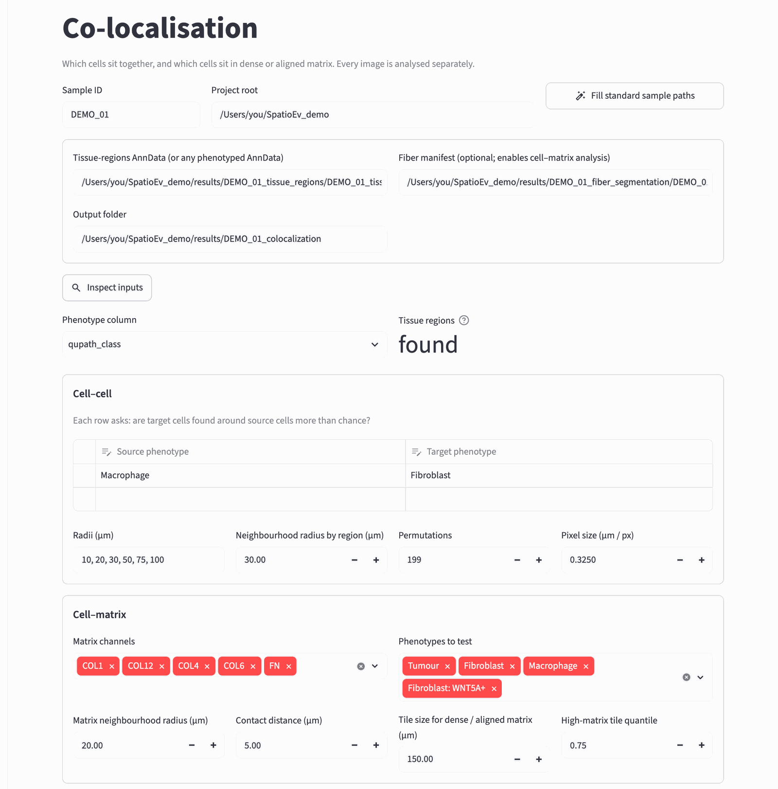
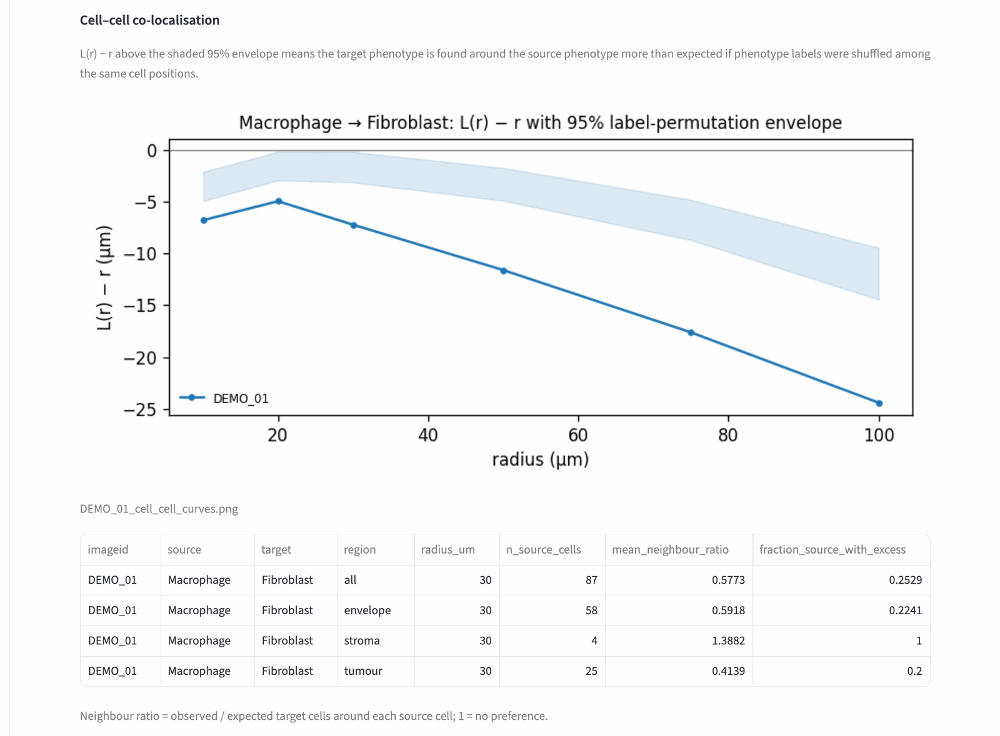
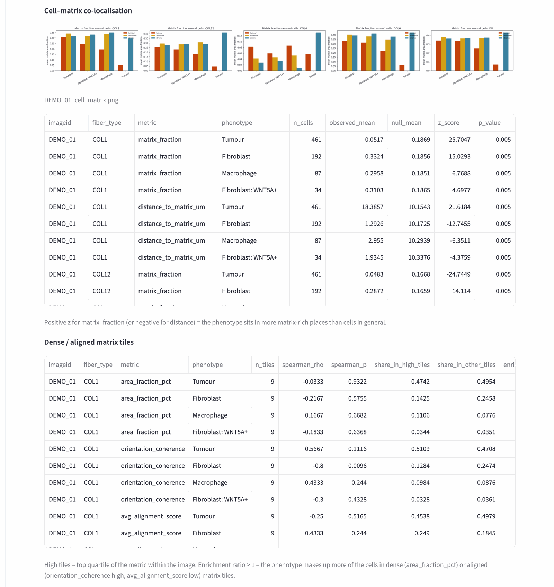

# 8. Co-localisation

**What it does:** answers two kinds of question for each core.

- **Cell–cell:** are cells of one type found around cells of another type
  more (or less) often than chance? For example, *are macrophages close to
  fibroblasts?*
- **Cell–matrix:** do cells of a type sit in more matrix-rich, or more
  aligned, places than cells in general? For example, *do WNT5A+ fibroblasts
  sit in dense collagen?*

"Chance" is worked out by shuffling the cell-type labels among the same cell
positions many times. That keeps the tissue's shape and cell density, and
only breaks the link between position and type.

**What it needs:** the tissue regions from [step 7](regions.md) for per-region
results, and the fiber results from [step 6](fibers.md) for the cell–matrix
part.

## A. Choose a core and the questions to ask

Open **colocalization** in the sidebar, type the **Sample ID**, press **Fill
standard sample paths**, then **Inspect inputs**.

{ width="900" }

**Cell–cell.** Each row of the small table is one question: *source* →
*target* means "are target cells found around source cells?" Click a cell of
the table to choose a cell type; click the empty bottom row to add a
question.

- **Radii (µm)**: the distances at which it is tested. The default (10 to
  100 µm) covers direct contact up to about ten cells away.
- **Neighbourhood radius by region (µm)**: the distance used for the
  per-region table.
- **Permutations**: how many shuffles; 199 is enough for a first look, 999
  for final results (slower).

**Cell–matrix** (appears when a fiber result is found):

- **Matrix channels** and **Phenotypes to test**: which matrix stains and
  cell types to include.
- **Matrix neighbourhood radius (µm)**: how much matrix lies within this
  distance of each cell.
- **Contact distance (µm)**: a cell counts as "in contact" with matrix when
  matrix lies within this distance.
- **Tile size** and **High-matrix tile quantile**: for the dense / aligned
  matrix tiles analysis, the core is cut into tiles (150 µm), and the top
  quarter of tiles by matrix density or alignment counts as "high".

Press **Run co-localisation**.

## B. Read the results

### Cell–cell

{ width="900" }

The curve shows, for each radius, how strongly target cells gather around
source cells (L(r) − r). The shaded band is the range expected by chance.

- Curve **above** the band: targets are found around sources **more** than
  chance (attraction).
- Curve **inside** the band: no evidence either way.
- Curve **below** the band: **less** than chance (the two types keep apart).

In the demo picture, DEMO_01's macrophages keep away from fibroblasts. In the
group B cores the curve rises above the band at short distances.

The table gives the same per region: a **neighbour ratio** above 1 means more
target cells around each source cell than expected.

### Cell–matrix

{ width="900" }

- The bar charts show the average matrix fraction around each cell type, per
  region.
- **Enrichment table**: a positive `z_score` for `matrix_fraction` (or a
  negative one for `distance_to_matrix_um`) means that cell type sits in more
  matrix-rich places than cells in general. `p_value` comes from the label
  shuffles.
- **Dense / aligned matrix tiles**: an `enrichment_ratio` above 1 means the
  cell type makes up more of the cells in the densest (or most aligned)
  tiles than elsewhere.

!!! note "One core is not a result"
    These numbers describe one core. Whether a pattern holds across patients,
    and differs between groups, is the job of [Compare groups](cohort.md).

## C. Run for every core

As before, use **Run for every core** at the bottom of the page. Cores
without tissue regions are listed as **missing input**.

The result files are explained in [Output files](outputs.md#co-localisation).

Next: [Compare groups](cohort.md).
