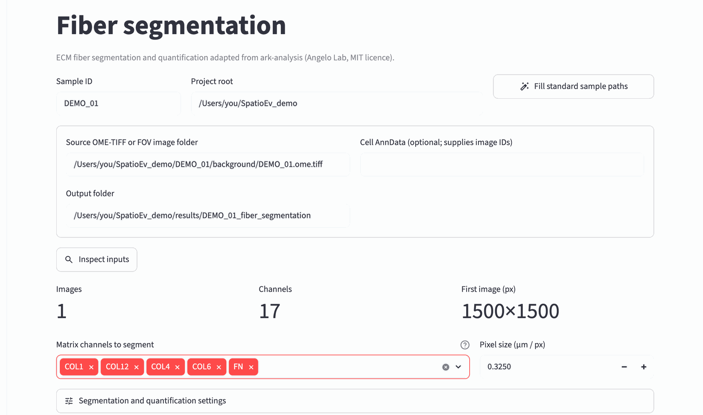
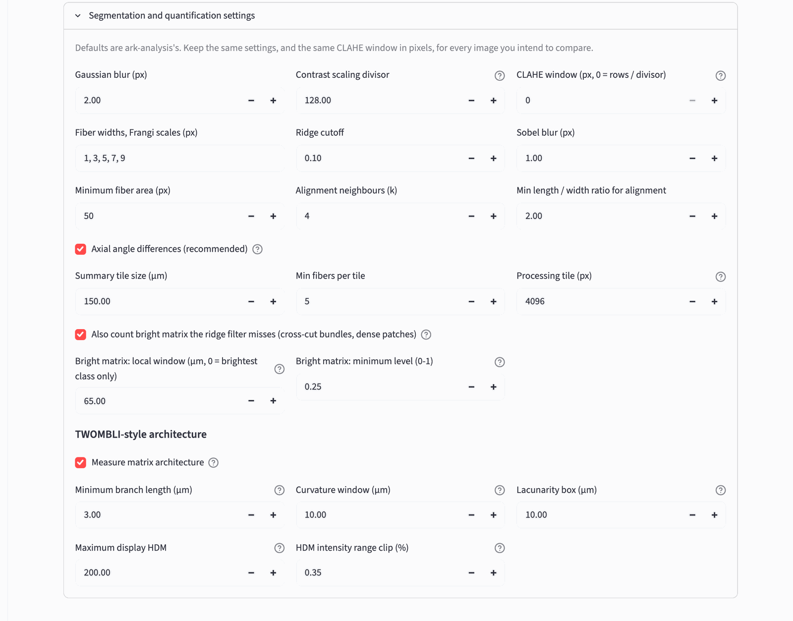
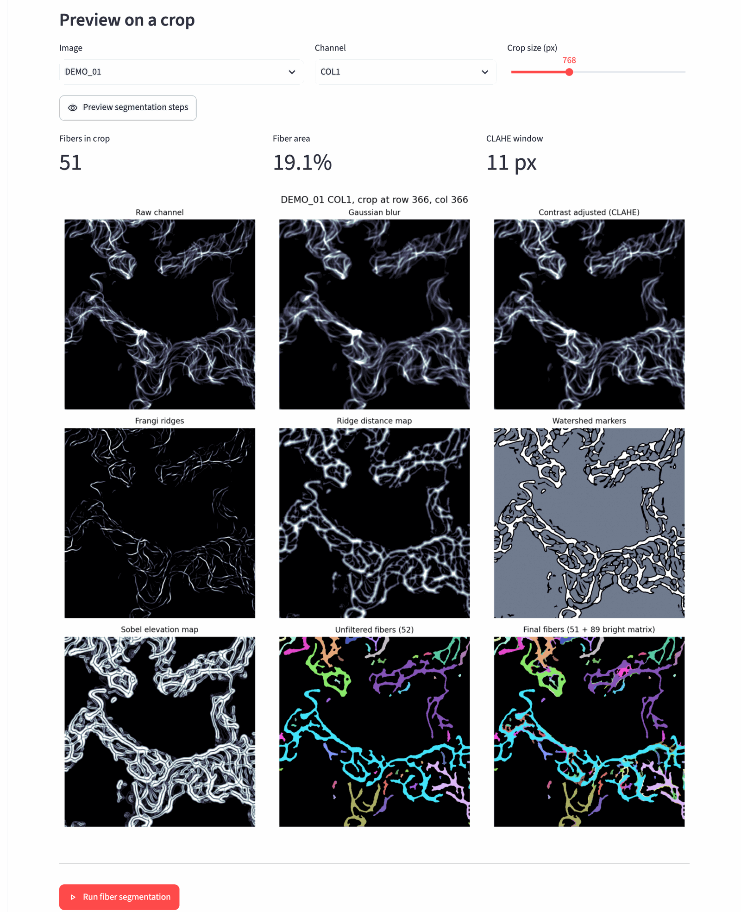
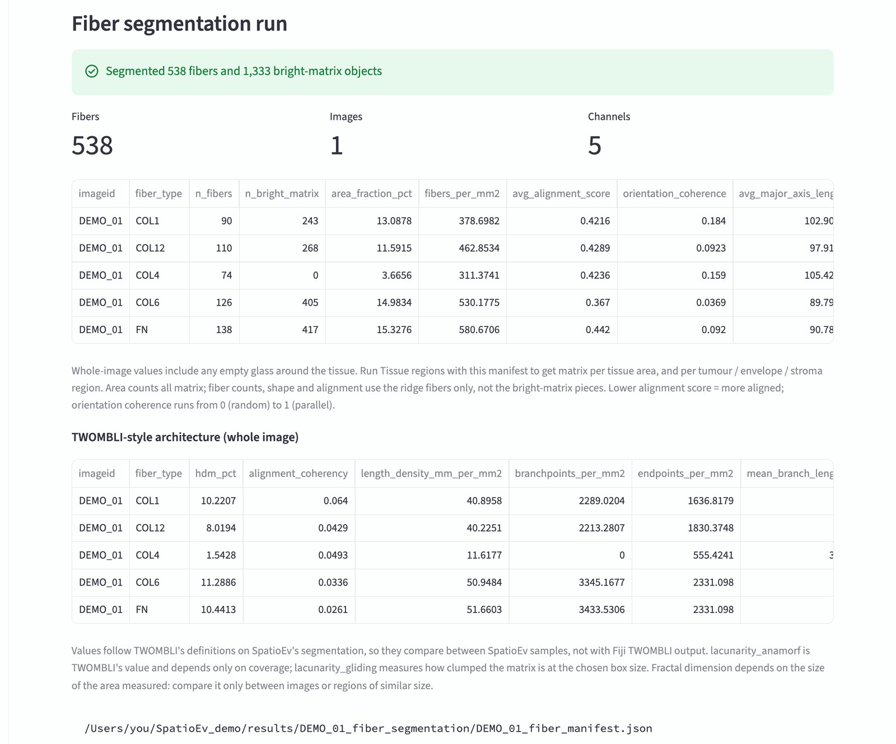
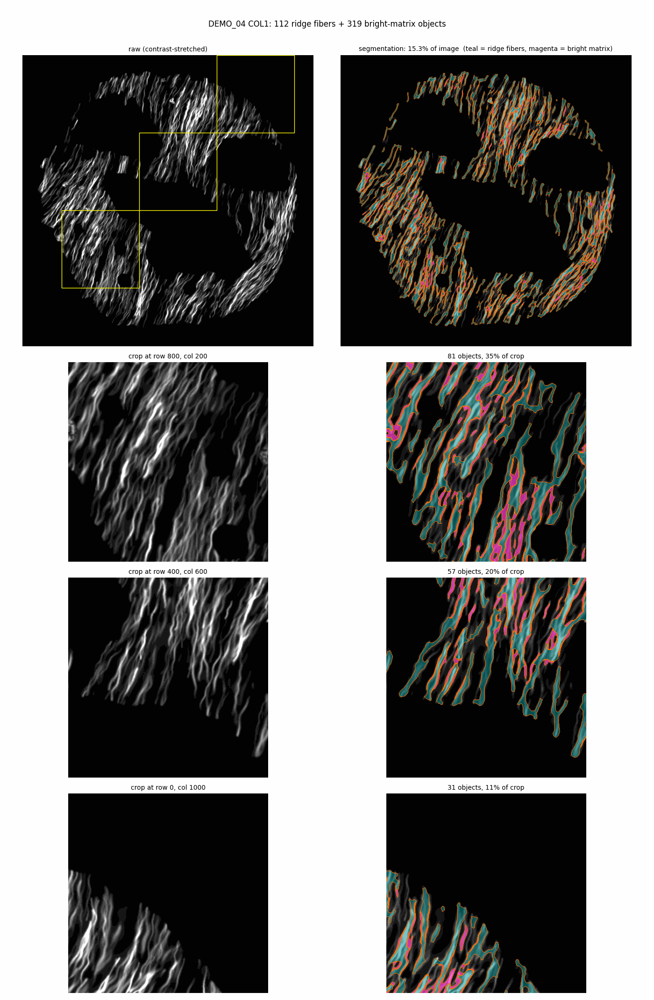
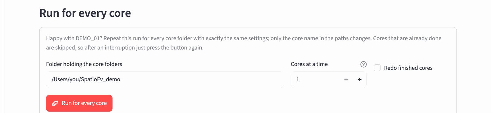
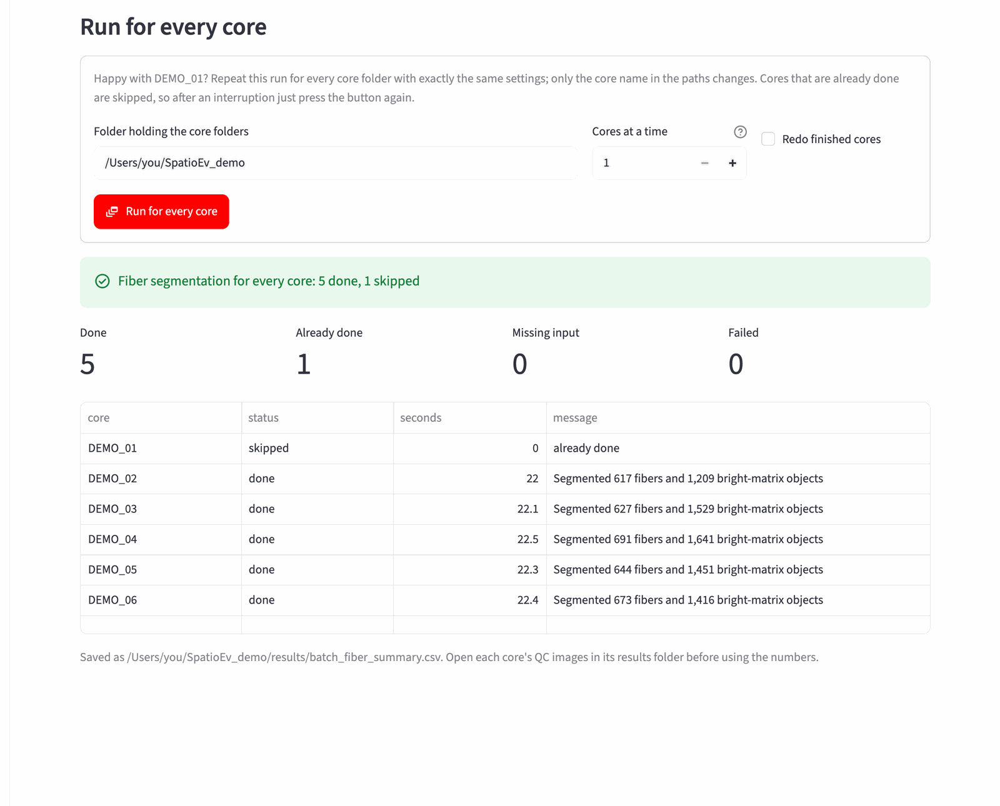

# 6. Matrix fibers

**What it does:** finds the extracellular-matrix fibers in each matrix
channel you choose (for example COL1, COL4, COL6, COL12, FN) and measures
them: how much of the tissue is matrix, how long, thick and aligned the
fibers are, and TWOMBLI-style architecture (branching, curvature, gaps,
high-density matrix). The method is adapted from
[ark-analysis](https://github.com/angelolab/ark-analysis).

**What it needs:** only the image, so you can run it before, during or after
the QuPath step.

**How long:** about 20 seconds per core for five channels on the demo; a few
minutes per core for full-size TMA cores.

## A. Choose a core and check the inputs

Open **fiber segmentation** in the sidebar (or *Open* next to *04 Fiber
segmentation* on the home page).

{ width="900" }

1. Type the **Sample ID** of a core with typical matrix (for the demo:
   `DEMO_01`) and check the **Project root**.
2. Press **Fill standard sample paths**. The image path becomes
   `<project root>/<core>/background/<core>.ome.tiff` and the output folder
   `<project root>/results/<core>_fiber_segmentation`.
   *Cell AnnData* is optional and can stay empty.
3. Press **Inspect inputs**. You should see 1 image, the number of channels
   (17 for the demo panel) and the image size.
4. In **Matrix channels to segment**, keep COL1 and add the other matrix
   channels you want (click the box, pick a channel, repeat). Each channel is
   segmented separately.
5. **Pixel size** is read from the image (0.325 µm/px for the TMA scans). Only
   change it if it shows 0.

## B. Settings { #settings }

Click **Segmentation and quantification settings** to open them.

{ width="900" }

The defaults are ark-analysis's. For multiplexed TMA cores scanned at
0.325 µm/px, change only these three:

| Setting | Value | Why |
|---|---|---|
| **Minimum fiber area (px)** | `50` | Removes background specks smaller than about 5 µm². |
| **Also count bright matrix…** | ticked | The ridge filter traces fibers but misses filled matrix: collagen cut across, and dense patches. This adds them (they show in magenta in the pictures). |
| **Bright matrix: local window (µm)** | `65` (default) | Catches large, medium-bright patches next to dark gaps. |

Leave everything else as it is.

!!! warning "Use the same settings for every core you will compare"
    Measurements only compare between images segmented the same way. Settle
    the settings on one or two cores, then use **Run for every core** (below),
    which copies them exactly.

??? note "What the other settings do"
    - **Gaussian blur**, **Sobel blur**: smoothing before finding ridges and
      edges. Raise slightly for noisy images.
    - **Contrast scaling divisor**, **CLAHE window**: local contrast
      enhancement. The window is the image height divided by the divisor
      unless you set a fixed window; set a fixed window if your images differ
      in size (for example TMA cores and whole slides).
    - **Fiber widths**: the fiber thicknesses (in pixels) the ridge filter looks
      for.
    - **Ridge cutoff**: how strong a ridge must be to count.
    - **Alignment neighbours (k)**, **Min length / width ratio**: how fiber
      alignment is scored (each fiber against its *k* nearest elongated
      neighbours).
    - **Summary tile size (µm)**: the tile size for the per-tile summary
      table (150 µm by default).
    - **Bright matrix: minimum level**: raise it if diffuse background is
      being filled in.
    - **TWOMBLI-style architecture**: branch length, curvature window,
      lacunarity box and high-density-matrix settings, following TWOMBLI's
      definitions.

## C. Preview on a crop (optional)

Before running the whole core, you can watch every step on a small crop.
Choose the **Channel** and press **Preview segmentation steps**:

{ width="900" }

The nine panels go from the raw channel (top left) to the final fibers
(bottom right). The last panel is what will be measured: coloured shapes
should cover the fibers you can see in the raw panel, and not the dark
background. Its title gives the number of ridge fibers and of bright-matrix
pieces.

## D. Run it and check the pictures

Press **Run fiber segmentation** at the bottom of the page. When it finishes
you see the per-channel summary:

{ width="900" }

Then come the **quality-control pictures**, one per channel. They are also
saved in `results/<core>_fiber_segmentation/qc/`. **Always look at them**
before using the numbers:

{ width="700" }

- Top row: the whole core, raw (left) and with the segmentation on top
  (right). Yellow boxes mark the three crops below.
- Rows below: full-resolution crops of a dense, a medium and a sparse area.
- **Teal** = fibers traced by the ridge filter, **magenta** = bright matrix
  added by *Also count bright matrix*, **orange** = outlines.

What good looks like: the fibers you can see in the raw crop are covered;
filled round patches are filled (magenta), not just outlined; empty
background stays empty. If not, see
[Troubleshooting](troubleshooting.md#results-look-wrong).

## E. Run for every core

When the pictures look right, scroll to **Run for every core**:

{ width="900" }

- **Folder holding the core folders**: your project root.
- **Cores at a time**: keep `1` on a laptop; each core needs as much memory
  as one run.
- **Redo finished cores**: leave unticked. Cores that already have a result
  are skipped, so after an interruption (laptop closed, Terminal quit) you
  just press the button again.

Press **Run for every core**. A progress bar counts the cores; at the end a
table lists each core:

{ width="900" }

| Status | Meaning |
|---|---|
| `done` | Segmented with your settings. |
| `skipped` | Already had a result (for example the core you set up on). |
| `missing input` | A file it needs is missing; the message says which. |
| `failed` | Something went wrong for this core; see its `…_worker.log`. |

Then open a few cores' QC pictures (in each `results/<core>_fiber_segmentation/qc/`
folder) to check that the settings suit them too.

!!! tip "The same from Terminal"
    `spatioev batch` does exactly what the button does, and is handy for
    hundreds of cores or for running overnight:

    ```bash
    spatioev batch /Users/you/Data/TMA_072/results/OXF047_6-C_fiber_segmentation
    ```

    Give it the output folder of the core you set up on. Add `--jobs 2` to
    process two cores at a time if your Mac has plenty of memory.

The result files are explained in [Output files](outputs.md#matrix-fibers).

Next: [Tissue regions](regions.md) (after [cell types](qupath.md)).
