# 5. Cell types in QuPath

**What it does:** you decide what type every cell is (tumour, fibroblast,
macrophage …) with QuPath's object classifier, using the cells and marker
measurements SpatioEv already has.

**The route, in short:** SpatioEv writes each core's cells into a file
(**A**); QuPath imports them once (**B**, **C**); you classify them (**D**);
QuPath exports the classes (**E**); SpatioEv collects them (**F**). Cells
travel by their ID (`cell_id`), so nothing is matched by position and nothing
is lost.

```text
 SpatioEv                    QuPath                         SpatioEv
 A. write cells  ──────►  B. project  C. import cells
                                     D. classify
                          E. export classes  ──────►  F. collect classes
```

!!! tip "Demo data with ready-made classes"
    If you made the demo with `--with-classes`, the QuPath part is already
    done for you: go straight to [F. Collect the classes](#f-collect-the-classes-in-spatioev).

## A. Prepare the cells in SpatioEv

Open **qupath bridge** in the sidebar.

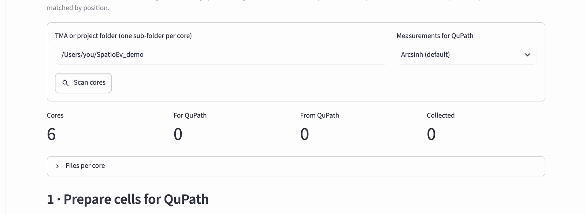{ width="900" }

1. **TMA or project folder**: your project root.
2. **Measurements for QuPath**: keep *Arcsinh (default)*. These are the
   marker levels QuPath's classifier will use; the arcsinh scale stops a few
   very bright cells from dominating.
3. Press **Scan cores**. *Cores* should equal the number of core folders.
   Open *Files per core* to see which files each core has.

Then, under **1 · Prepare cells for QuPath**, press **Write QuPath cell
files**:

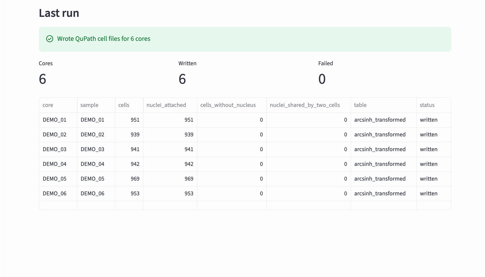{ width="900" }

Every core now has `<core>/qupath/<core>_cells.geojson`. *Failed* should be
0.

### Save the two QuPath scripts

Under **2 · Classify in QuPath**, save SpatioEv's two QuPath scripts into
QuPath's scripts folder (the box suggests `~/QuPath/v0.7/scripts`) with
**Save QuPath scripts**:

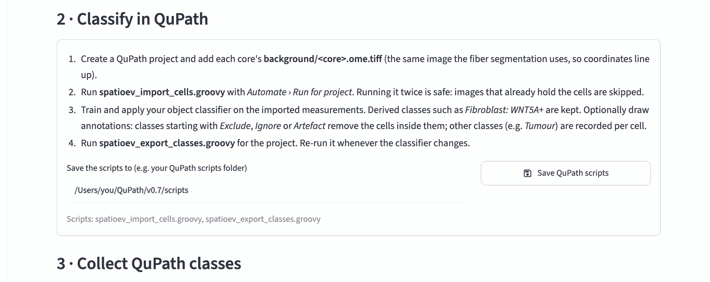{ width="900" }

They then appear in QuPath under **Automate › User scripts…** as *spatioev
import cells* and *spatioev export classes*.

!!! note "Not listed in QuPath?"
    In QuPath choose *Automate › User scripts… › Open script directory* to see
    which folder QuPath uses, and save the scripts there instead. Do this again
    after updating SpatioEv, so QuPath has the newest versions.

??? note "The same from Terminal"
    ```bash
    spatioev qupath prepare /Users/you/Data/TMA_072
    ```

    ```bash
    spatioev qupath scripts ~/QuPath/v0.7/scripts
    ```

## B. Make a QuPath project

A QuPath *project* is a folder that remembers your images, cells,
classifiers and annotations.

1. In QuPath: **File › Project › Create project…**. Make a new, empty folder
   called `qupath_project` inside your project root and choose it.
2. **File › Project › Add images…** opens the import window:

    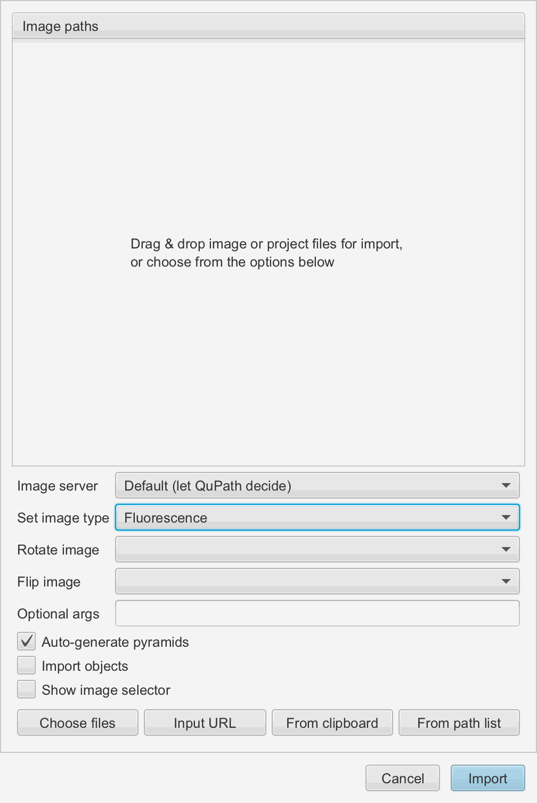{ width="700" }

3. Add every core's image, `<core>/background/<core>.ome.tiff`. The quickest
   way: in Finder, open your project root, type `.ome.tiff` in the search box
   and choose to search in that folder; select all results (++cmd+a++) and
   drag them onto the import window.
4. Set **Set image type** to **Fluorescence** and click **Import**.

All cores are listed in the **Project** tab:

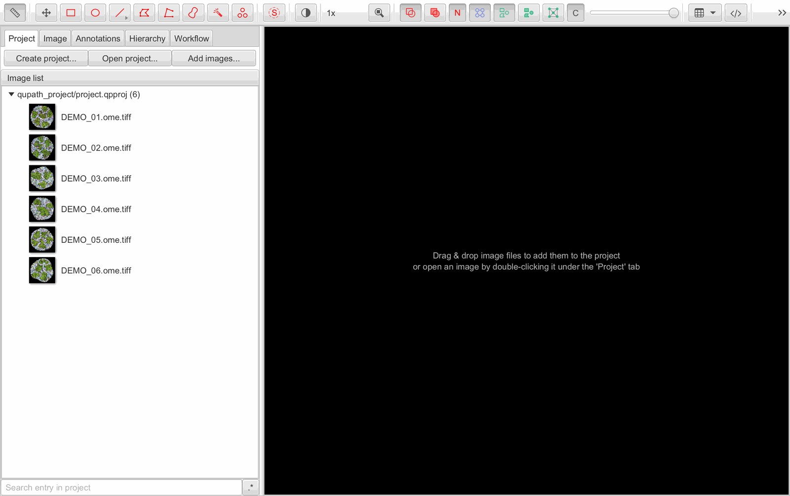{ width="900" }

!!! warning "Use the images in the core folders"
    Add the images from each core's `background` folder, not copies from
    elsewhere. The import script finds each core's cells next to its image.

## C. Import the cells

1. **Automate › User scripts… › spatioev import cells**. The script opens in
   QuPath's script editor.
2. In the script editor: **Run › Run for project** (also under the **⋮**
   button next to *Run*). Move all images to the right-hand list (the **>>**
   button) and click **OK**:

    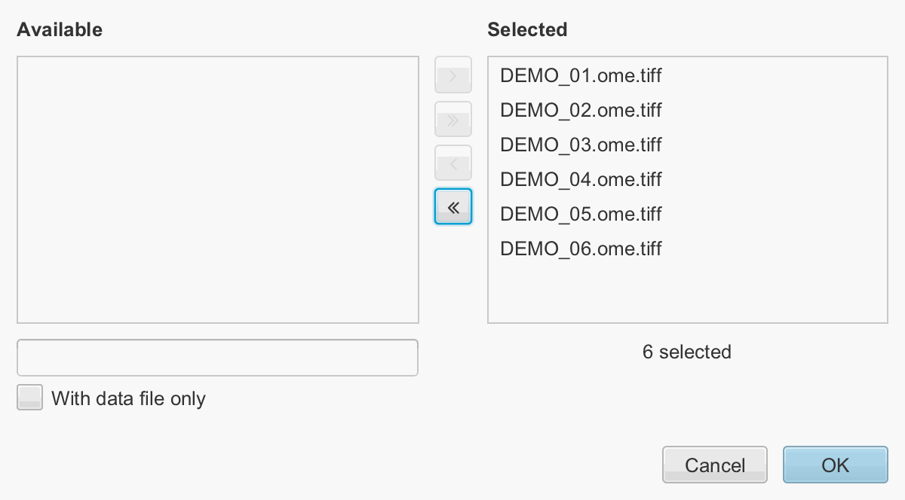{ width="700" }

3. Each image gets its cells. The log at the bottom of the script editor
   says, per core, *SpatioEv: imported … cells into <core> (… with a
   nucleus)*.

!!! note ""A selected image is open in the viewer""
    *Run for project* works on the saved copy of each image. If you changed
    the open image, save it first (**File › Save**). When QuPath afterwards
    asks *Refresh open images?*, click **Yes**.

Double-click a core in the **Project** tab to look at it. Every cell has its
exact outline and nucleus:

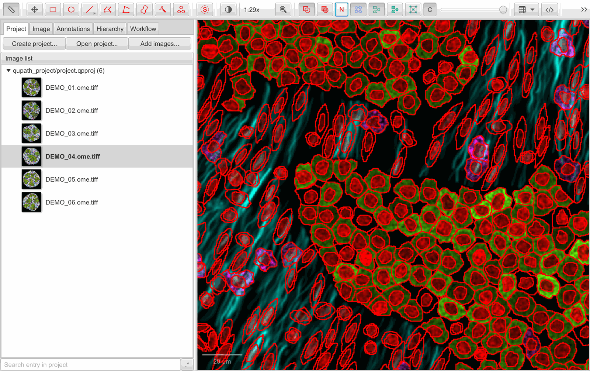{ width="900" }

**Measure › Show detection measurements** lists every cell with its
measurements. A bare marker name (`CD68`) is the whole-cell average;
`CD68 nucleus` is the nucleus average. Each cell's **Name** is its SpatioEv
`cell_id`; do not change it.

!!! note "Running the import twice is safe"
    Images that already hold SpatioEv cells are skipped, so you never lose
    classifications by accident.

## D. Classify the cells

This part is QuPath's own. QuPath's tutorials explain it with pictures:
[Cell classification](https://qupath.readthedocs.io/en/stable/docs/tutorials/cell_classification.html)
and, for multiplexed panels,
[Multiplexed analysis](https://qupath.readthedocs.io/en/stable/docs/tutorials/multiplex_analysis.html).
The outline below is how it fits with SpatioEv.

1. **Decide your class names first** and use them everywhere, for example
   `Tumour`, `Fibroblast`, `Macrophage`, `T cell`, `Endothelial`, `Other`.
   SpatioEv uses them exactly as written.
2. **Train a classifier** for the main cell types: on a few representative
   cores, mark example cells of each class, then
   **Classify › Object classification › Train object classifier…**. Set
   **Object filter** to *Cells* and **Features** to *Selected measurements*,
   then **Select** to choose the marker measurements. Give it a **Classifier
   name**, for example `cell_types`, and **Save**.

    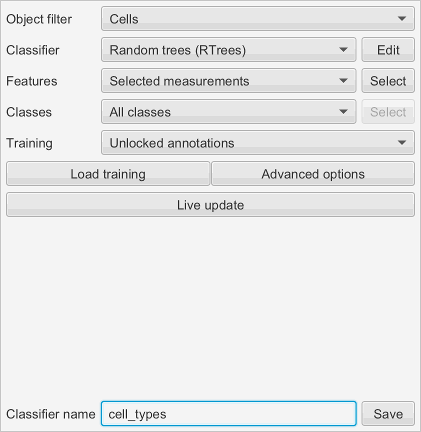{ width="700" }

3. **Marker-positive subsets** such as WNT5A+ fibroblasts:
   **Classify › Object classification › Create single measurement
   classifier…** on the `WNT5A` measurement, with *WNT5A+* as the class above
   the threshold. Combine it with `cell_types` in **Create composite
   classifier…**. Cells then get classes like `Fibroblast: WNT5A+`, which
   SpatioEv keeps.
4. **Apply the classifier to every core**: open **Automate › Script
   editor**, type the line below (with your classifier's name), and use
   **Run › Run for project**:

    ```groovy
    runObjectClassifier("cell_types")
    ```

5. **Leave out bad areas** (folds, bubbles, out-of-focus tissue): draw an
   annotation around them and give it the class `Exclude` (or `Ignore`, or
   `Artefact`). SpatioEv drops the cells inside.

When cells are classified, they are drawn in their class colour:

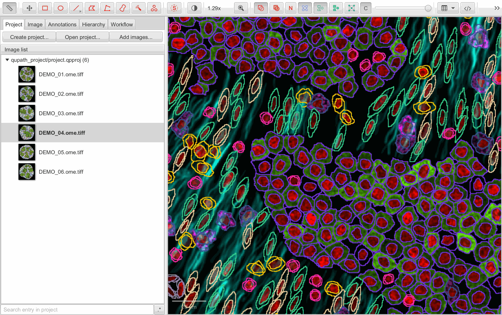{ width="900" }

!!! tip "Check a few cores by eye"
    Open several cores, especially from different TMAs or blocks, and check
    that the classes match the markers. Staining can differ between blocks,
    so train the classifier on examples from all of them.

## E. Export the classes from QuPath

1. **Automate › User scripts… › spatioev export classes**.
2. Save any open image (**File › Save**), then **Run › Run for project**,
   move all images to the right, **OK**.
3. The log says, per core, *SpatioEv: exported … cells from <core> …
   Classes: {…}*:

    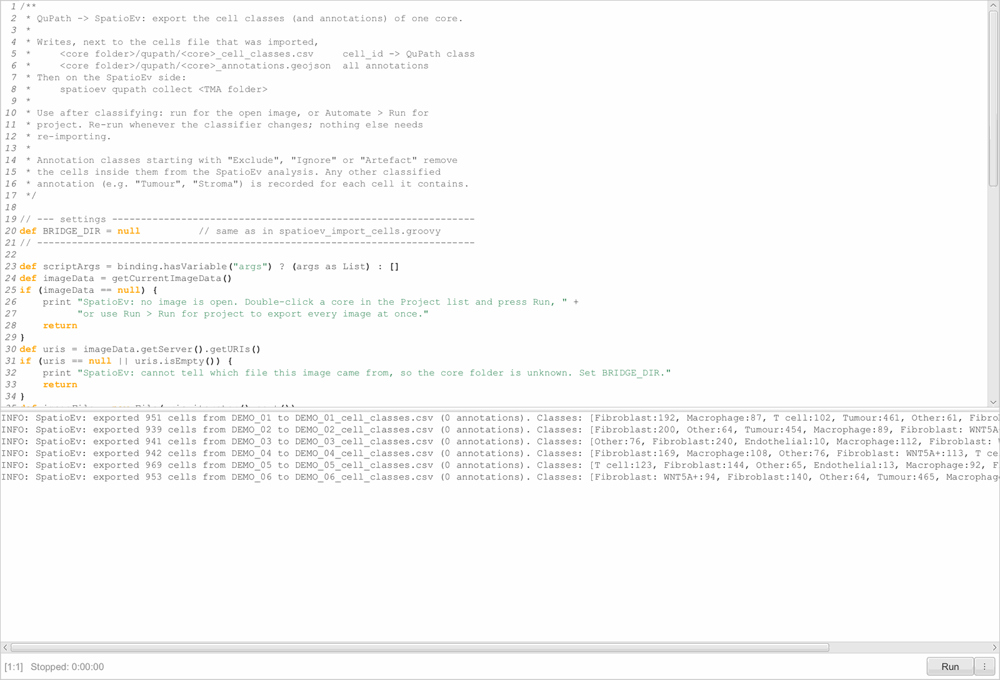{ width="700" }

This writes `<core>/qupath/<core>_cell_classes.csv` and
`<core>_annotations.geojson` for every core. **Run it again whenever you
change the classifier**; nothing needs re-importing.

## F. Collect the classes in SpatioEv

Back in the app's **qupath bridge** page, under **3 · Collect QuPath
classes**, keep *Drop cells inside Exclude / Ignore / Artefact annotations*
ticked and press **Collect classes**:

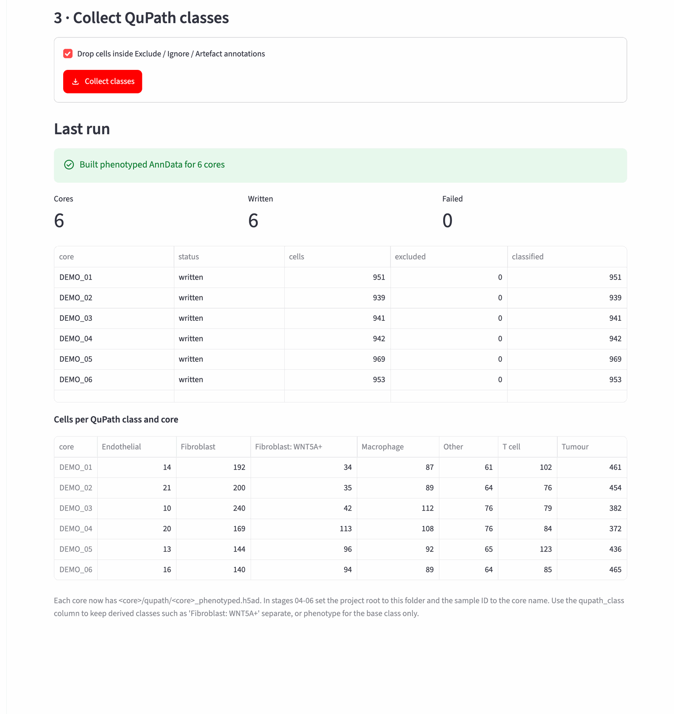{ width="900" }

The table shows how many cells of each class every core has: a quick check
that every core was classified. Each core now has
`<core>/qupath/<core>_phenotyped.h5ad`, which steps 7 and 8 use.

??? note "The same from Terminal"
    ```bash
    spatioev qupath collect /Users/you/Data/TMA_072
    ```

Next: [Matrix fibers](fibers.md) (if not done yet), then
[Tissue regions](regions.md).
