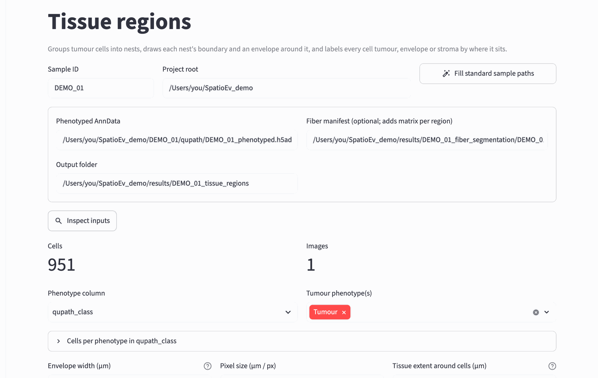
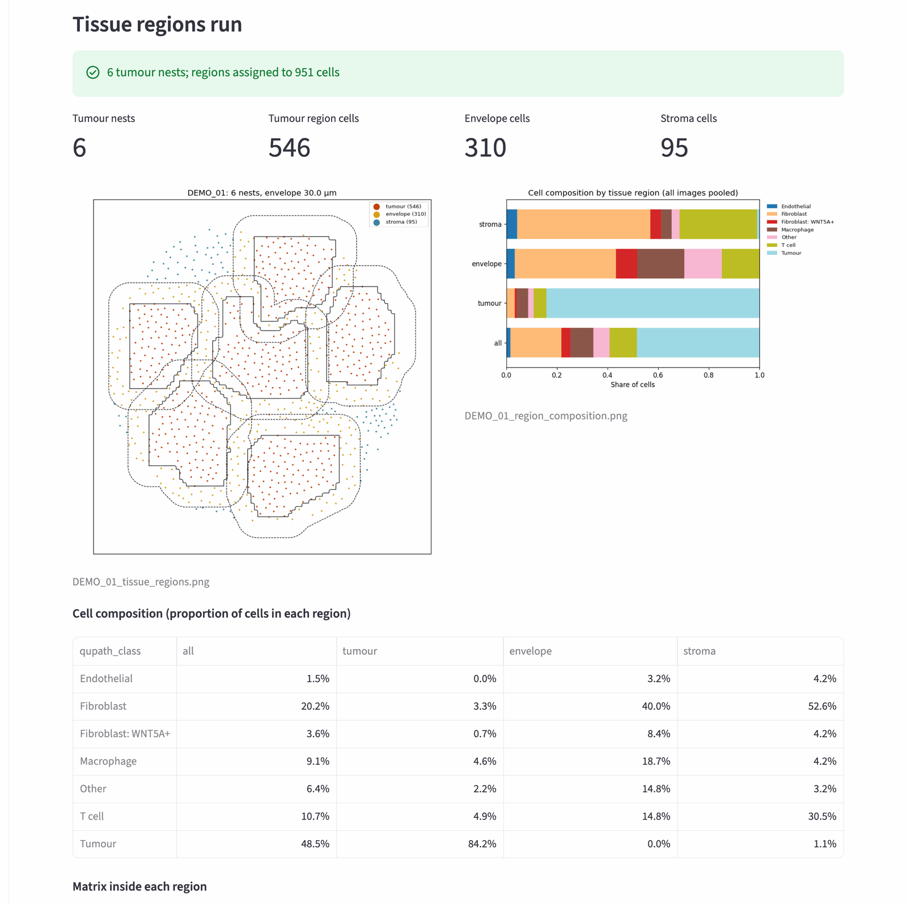
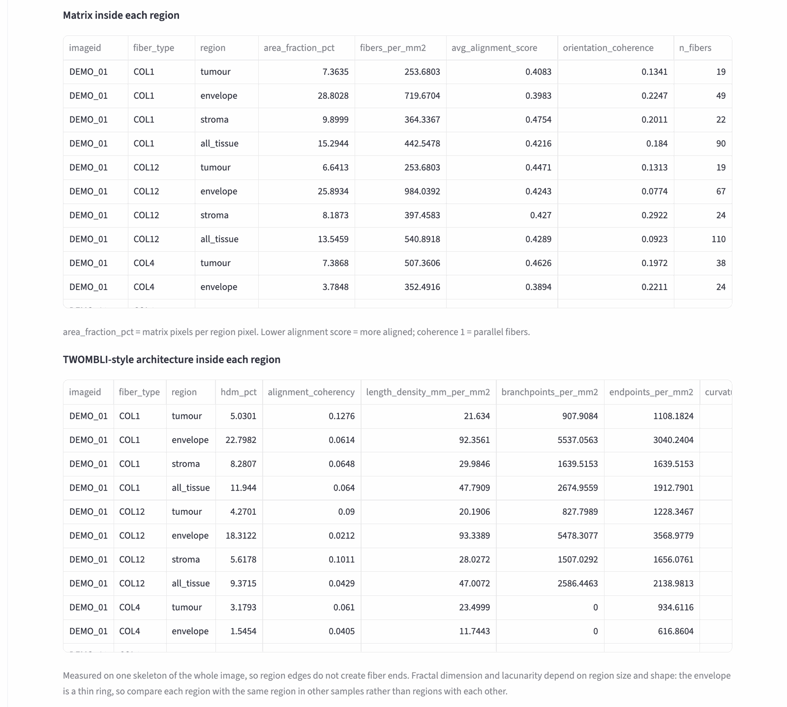

# 7. Tissue regions

**What it does:** groups tumour cells into **nests**, draws each nest's
outline and a ring around it (the **envelope**), and labels every cell
*tumour*, *envelope* or *stroma* by where it sits. It then reports the cell
composition of each region and, if fiber segmentation was run, the matrix
inside each region.

**What it needs:** the cell types from [step 5](qupath.md)
(`<core>/qupath/<core>_phenotyped.h5ad`). Fiber results from
[step 6](fibers.md) are optional but add the matrix-per-region tables.

```text
        stroma                 envelope = a ring of fixed width (30 µm by
   ┌──────────────┐            default) just outside each nest's outline
   │   envelope   │
   │  ┌────────┐  │            tumour = inside the nest outline
   │  │ tumour │  │
   │  └────────┘  │            stroma = everything else
   └──────────────┘
```

## A. Choose a core and check the inputs

Open **tissue regions** in the sidebar.

{ width="900" }

1. Type the **Sample ID** (for the demo, `DEMO_01`) and press **Fill
   standard sample paths**. *Phenotyped AnnData* points at the core's QuPath
   result; *Fiber manifest* fills in if fiber segmentation was run.
2. Press **Inspect inputs**. You see the number of cells.
3. **Phenotype column**: keep `qupath_class` (your QuPath classes).
4. **Tumour phenotype(s)**: the class or classes that make up tumour nests,
   usually just `Tumour`. Open *Cells per phenotype* to check the class names
   and counts. If tumour cells also carry a sub-class from a composite
   classifier (for example `Tumour: WNT5A+`), select those too, or choose the
   phenotype column `phenotype`, which holds only the part before the colon.

## B. Settings

- **Envelope width (µm)**: how wide the ring around each nest is. 30 µm is
  about two to three cell diameters.
- **Pixel size (µm / px)**: filled in from the fiber result. If it shows 0,
  type `0.325` (or your scan's pixel size).
- **Tissue extent around cells (µm)**: pixels within this distance of any
  cell count as tissue when region areas are measured, so empty glass is not
  counted.
- **Nest detection settings** (folded away): leave them as they are at first.
  After the run, check the region map (below) and adjust only if nests look
  wrong:

| Problem in the map | Change |
|---|---|
| Nests are rings or broken into pieces | Raise **Gap closing**, or **Boundary grid** (for example to 10 µm) |
| Separate nests merged into one | Lower **Linking radius scale** (for example 0.7) |
| Small groups of tumour cells count as nests | Raise **Minimum cells per nest** |

## C. Run it and check the map

Press **Assign tissue regions**.

{ width="900" }

- **The region map** (left): every dot is a cell, coloured by region. Solid
  lines are nest outlines, dashed lines the outer edge of the envelope. The
  nests should follow the tumour areas you see in the image.
- **The composition chart** (right) and the table below it: the share of each
  cell type in each region and overall (*all*).

Further down, **Matrix inside each region** gives, per matrix channel and
region, the matrix area fraction, fiber density and alignment, and the
architecture measurements:

{ width="900" }

!!! note "Comparing regions"
    The envelope is a thin ring and the stroma is whatever is left, so their
    shapes differ a lot. Compare each region with **the same region in other
    cores** (for example envelope vs envelope across patients), which is what
    [Compare groups](cohort.md) does.

## D. Run for every core

As in [step 6](fibers.md#e-run-for-every-core): scroll down to **Run for
every core** and press it. Cores without cell types yet are listed as
**missing input** (*no cell AnnData*); collect their QuPath classes and press
the button again.

The result files are explained in [Output files](outputs.md#tissue-regions).

Next: [Co-localisation](colocalisation.md).
